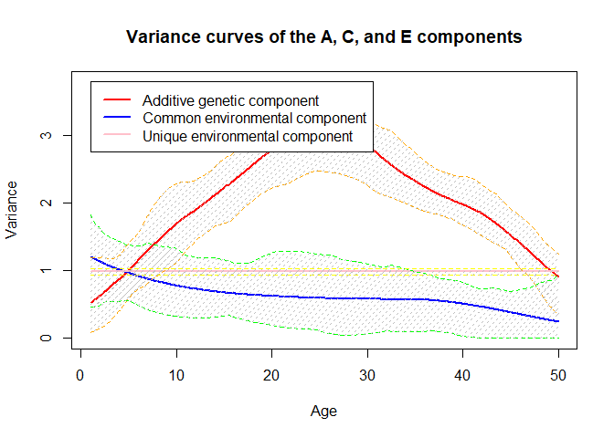

-   [ACEt v1.8.2](#acet-v1.8.2)
    -   [Installation](#installation)
        -   [Most recent version](#most-recent-version)
    -   [Application to an example
        dataset](#application-to-an-example-dataset)
    -   [Reference](#reference)

    knitr::opts_chunk$set(fig.path='Figs/')

# ACEt v1.8.2

## Installation

The R package can be installed from CRAN

    install.packages("ACEt")

The installation requires *Rcpp-0.11.1* and has been tested on
*R-4.1.3*. The installation of the *ACEt* package also requires
installing the *BH* and *RcppArmadillo* packages.

Please contact <lianghe@health.sdu.dk> for more information.

### Most recent version

To install the latest version from github:

    install.packages("devtools")
    library(devtools)
    install_github("lhe17/ACEt")

## Application to an example dataset

We illustrate how to utilize the *ACEt* R package with an example
dataset that can be loaded with the following codes. More detail about
the method is given in He et al. (2016) and He et al. (2017).

    library(ACEt)
    data(data_ace)

The example dataset contains two matrices `mz` and `dz` for MZ and DZ
twins, respectively. Each matrix includes 2500 twin pairs, of which the
first two columns are the quantitative phenotype of the twin pair and
the third column (`T_m` or `T_d`) is age.

    attributes(data_ace)
    #> $names
    #> [1] "mz" "dz"
    head(data_ace$mz)
    #>                            T_m
    #> [1,]  2.5638027  4.7355457   1
    #> [2,] -3.1959902 -3.0133873   1
    #> [3,]  1.3924694  2.8656795   1
    #> [4,]  2.4519483  1.9145994   1
    #> [5,] -0.4186678  1.3470608   1
    #> [6,] -1.2805044 -0.5234272   1
    head(data_ace$dz)
    #>                            T_d
    #> [1,]  0.1402850 -0.3430456   1
    #> [2,]  0.8588600 -0.7381698   1
    #> [3,]  0.4025476  0.2794685   1
    #> [4,] -0.4564107  0.2008932   1
    #> [5,] -0.2458682 -3.0600677   1
    #> [6,]  0.1459282  0.4588418   1

The age is distributed uniformly from 1 to 50 in both twin datasets and
the phenotypes are normally distributed with a mean equal to zero. As
discussed in He et al. (2017), before used as an input for this package,
the phenotype should be centered, for example, by using residuals from a
linear regression model `lm()` in which covariates for the mean function
can be included. Fitting an ACE(t) model can be done by calling the
`AtCtEt` function, in which users can specify a function (null, constant
or splines) for each component independently through the `mod` argument.

    # fitting the ACE(t) model
    re <- AtCtEt(data_ace$mz, data_ace$dz, mod = c('d','d','c'), knot_a = 6, knot_c = 4)
    summary(re)
    #>            Length Class  Mode   
    #> n_beta_a     1    -none- numeric
    #> n_beta_c     1    -none- numeric
    #> n_beta_e     1    -none- numeric
    #> beta_a       7    -none- numeric
    #> beta_c       5    -none- numeric
    #> beta_e       1    -none- numeric
    #> hessian_ap 169    -none- numeric
    #> hessian    169    -none- numeric
    #> con          1    -none- numeric
    #> lik          1    -none- numeric
    #> knots_a     10    -none- numeric
    #> knots_c      8    -none- numeric
    #> knots_e      2    -none- numeric
    #> min_t        1    -none- numeric
    #> max_t        1    -none- numeric
    #> boot         0    -none- NULL

In the above script, an ACE(t) model is fitted for the example dataset.
The first two arguments specify the matrices of the phenotypes for MZ
and DZ twins, respectively. The argument `mod = c('d','d','c')`
specifies that we allow the variances of the A and C components to
change dynamically and assume the variance of the E component to be a
constant over age. The `mod` argument is a vector of three elements
corresponding to the A, C and E components that can be
`'d', 'c' or 'n'`, in which `'n'` represents the exclusion of a
component. For example, `mod = c('d','n','c')` indicates that we fit an
AE model with a dynamic A component and a constant E component. It
should be noted that the E component cannot be eliminated. We can also
give the number of knots for each component, which is ignored if we
choose `'c'` or `'n'` for that component. The number of randomly
generated initial values for the estimation algorithm can be specified
using the `robust` argument. Multiple initial values can be attempted to
minimize the risk of missing the global maximum. The `AtCtEt` function
returns both analytical and approximated Hessian matrices (shown below),
which are close to each other in general and can be used to compute
pointwise CIs. Note that the analytical Hessian is always positive
definite, but the approximated one is not necessarily positive definite.
The returned value `lik` is the negative log-likelihood that can be used
for LRT for the comparison of twin models.

    # part of the analytical Hessian matrix
    re$hessian[1:8,1:8]
    #>           [,1]      [,2]        [,3]         [,4]       [,5]       [,6]
    #> [1,] 3.3122436  8.572181   0.9774334   0.00000000   0.000000   0.000000
    #> [2,] 8.5721808 64.560338  43.2299744   2.22206265   0.000000   0.000000
    #> [3,] 0.9774334 43.229974 145.2021892  67.94632724   2.836022   0.000000
    #> [4,] 0.0000000  2.222063  67.9463272 182.31265682  68.569776   2.334633
    #> [5,] 0.0000000  0.000000   2.8360218  68.56977584 155.634291  54.989838
    #> [6,] 0.0000000  0.000000   0.0000000   2.33463321  54.989838 113.226897
    #> [7,] 0.0000000  0.000000   0.0000000   0.00000000   1.840752  22.878770
    #> [8,] 4.9109578 13.518421   2.7632296   0.02669836   0.000000   0.000000
    #>           [,7]        [,8]
    #> [1,]  0.000000  4.91095781
    #> [2,]  0.000000 13.51842124
    #> [3,]  0.000000  2.76322956
    #> [4,]  0.000000  0.02669836
    #> [5,]  1.840752  0.00000000
    #> [6,] 22.878770  0.00000000
    #> [7,] 11.077766  0.00000000
    #> [8,]  0.000000 11.02095804
    # part the Hessian matrix approximated by the L-BFGS algorithm
    re$hessian_ap[1:8,1:8]
    #>           [,1]      [,2]        [,3]         [,4]       [,5]       [,6]
    #> [1,] 3.3066880  8.583804   0.9771341   0.00000000   0.000000   0.000000
    #> [2,] 8.5838039 64.611733  43.1402778   2.22883073   0.000000   0.000000
    #> [3,] 0.9771341 43.140278 144.8342062  67.91347006   2.836111   0.000000
    #> [4,] 0.0000000  2.228831  67.9134701 181.14525247  67.405340   2.312405
    #> [5,] 0.0000000  0.000000   2.8361108  67.40534018 155.154944  55.376537
    #> [6,] 0.0000000  0.000000   0.0000000   2.31240520  55.376537 114.366468
    #> [7,] 0.0000000  0.000000   0.0000000   0.00000000   1.856622  23.555961
    #> [8,] 5.0462737 13.315584   2.7042919   0.02561431   0.000000   0.000000
    #>           [,7]        [,8]
    #> [1,]  0.000000  5.04627369
    #> [2,]  0.000000 13.31558433
    #> [3,]  0.000000  2.70429192
    #> [4,]  0.000000  0.02561431
    #> [5,]  1.856622  0.00000000
    #> [6,] 23.555961  0.00000000
    #> [7,] 11.486909  0.00000000
    #> [8,]  0.000000 11.08078500

The `AtCtEt` function returns the minus log-likelihood evaluated at the
estimates that is needed to make inference based on LRT. For example,
the following program tests whether the A or C component has a constant
variance with respect to age, we fit the null models and calculate the
p-values based on *χ*2 distributions. It can be seen that the
LRT has no sufficient statistical power to reject the constancy of the C
component with this sample size (`p1>0.05`). In addition, we test
whether the C component can be ignored by comparing `re_cc` and `re_cn`
and compute the p-value (`p3`) based on a mixture of *χ*2
distributions.

    re_cc <- AtCtEt(data_ace$mz, data_ace$dz, mod = c('d','c','c'), knot_a = 6, knot_c = 4)
    p1 <- pchisq(2*(re_cc$lik-re$lik), 4, lower.tail=FALSE)
    p1
    #> [1] 0.2079343
    re_ac <- AtCtEt(data_ace$mz, data_ace$dz, mod = c('c','d','c'), knot_a = 6, knot_c = 4)
    p2 <- pchisq(2*(re_ac$lik-re$lik), 6, lower.tail=FALSE)
    p2
    #> [1] 8.937498e-12
    re_cn <- AtCtEt(data_ace$mz, data_ace$dz, mod = c('d','n','c'), knot_a = 6, knot_c = 4)
    p3 <- 0.5*pchisq(2*(re_cn$lik-re_cc$lik), 1, lower.tail=FALSE)
    p3
    #> [1] 2.155026e-08

After fitting the ACE(t) model, we can plot the estimated variance
curves by calling the `plot_acet` function.

    plot_acet(re, ylab='Var', xlab='Age (1-50)')

By default, the 95% pointwise CIs are estimated using the delta method.
Alternatively, we can choose the bootstrap method by setting `boot=TRUE`
and giving the number of bootstrap resampling, the default value of
which is 100.

    ## fitting an ACE(t) model with the CIs esitmated by the bootstrap method 
    re_b <- AtCtEt(data_ace$mz, data_ace$dz, mod = c('d','d','c'), knot_a = 6, knot_c = 4, boot = TRUE, 
                   num_b = 60)
    plot_acet(re_b, boot = TRUE)

Next, we plot the age-specific heritability by setting the argument
`heri=TRUE` in the `plot_acet` function. And similarly we can choose
either the delta method or the bootstrap method to generate the CIs.

    ## plot dynamic heritability with the CIs using the delta method 
    plot_acet(re_b, heri=TRUE, boot = FALSE)

    ## plot dynamic heritability with the CIs using the bootstrap method 
    plot_acet(re_b, heri=TRUE, boot = TRUE)

The ACE(t)-p model is implemented in the `AtCtEtp` function, in which
users can choose exponential of penalized splines, a linear function or
a constant to model a certain component by setting the `mod` argument.
Compared to the ACE(t) model, it is not an essential problem to provide
an excessive number of knots (the default value of interior knots is 8)
when using the ACE(t)-p model as it is more important to ensure adequate
knots for curves with more fluctuation than to avoid overfitting. Below,
we fit the example dataset using the `AtCtEtp` function in which the A
and C components are modelled by B-splines of 8 interior knots and the E
component by a log-linear function. Similar to the `AtCtEt` function, we
can use the `robust` argument to specify the number of randomly
generated initial values, which can reduce the program’s possibility of
being stuck on a local maximum in the EM algorithm.

    ## fitting an ACE(t)-p model
    re <- AtCtEtp(data_ace$mz, data_ace$dz, knot_a = 8, knot_c = 8, mod=c('d','d','l'))
    summary(re)
    #>         Length Class  Mode     
    #> D_a       81   -none- numeric  
    #> D_c       81   -none- numeric  
    #> D_e        4   -none- numeric  
    #> pheno_m 5000   -none- numeric  
    #> pheno_d 5000   -none- numeric  
    #> T_m     5000   -none- numeric  
    #> T_d     5000   -none- numeric  
    #> knot_a    12   -none- numeric  
    #> knot_c    12   -none- numeric  
    #> knot_e     2   -none- numeric  
    #> beta_a     9   -none- numeric  
    #> beta_c     9   -none- numeric  
    #> beta_e     2   -none- numeric  
    #> con        1   -none- numeric  
    #> lik        1   -none- numeric  
    #> iter       4   -none- numeric  
    #> var_b_a    1   -none- numeric  
    #> var_b_c    1   -none- numeric  
    #> var_b_e    1   -none- numeric  
    #> mod        3   -none- character
    #> hessian    9   -none- numeric

The `AtCtEtp` function finds MLE of the variance
*σ**β**A*, *C*, *E*2 using the
integrated likelihood and also provides estimates of the spline
coefficients, i.e. *β**A*, *C*, *E*, which are based on
maximum a posteriori (MAP) estimation. For a variance component of
log-linearity (the E component in this example), *β* is a vector of two
elements that *e**x**p*(*β*) are the variances of this component at the
minimum and maximum age in the dataset. To obtain the empirical Bayes
estimates of *β**A*, *C*, *E* and the covariance matrix using
the MCMC method, we then call the `acetp_mcmc` function by plugging the
result from the `AtCtEtp` function. We can also specify the numbers of
the MCMC iterations and burn-in.

    re_mcmc <- acetp_mcmc(re, iter_num = 5000, burnin = 500)
    summary(re_mcmc)
    #>           Length Class  Mode   
    #> beta_a_mc   9    -none- numeric
    #> beta_c_mc   9    -none- numeric
    #> beta_e_mc   2    -none- numeric
    #> cov_mc    400    -none- numeric
    #> knots_a    12    -none- numeric
    #> knots_c    12    -none- numeric
    #> knots_e     2    -none- numeric
    #> min_t       1    -none- numeric
    #> max_t       1    -none- numeric

Given the esimates together with their covariance matrix, we can plot
the variance curves or dynamic heritability by calling the `plot_acet`
function. The `boot` option is ignored for the ACE(t)-p model.

    plot_acet(re_mcmc)

    plot_acet(re_mcmc, heri=TRUE)

Assigning too many knots in the ACE(t)-p model is much less harmful than
that in the ACE(t) model. Comparing the following two plots from the
application of the two models with 10 knots for each component to the
example data set, it suggests that the ACE(t) model has an overfitting
problem but the ACE(t)-p model works properly.

    

Finally, we give an example to test a linear or constant variance curve.
The `test_acetp` function is dedicated to the model comparison for the
ACE(t)-p model and returns a p-value from LRT using a resampling method
for testing log-linearity or from a *χ*2 distribution for
testing constancy. First, the following code tests whether the E
component is invariant with age. Before testing, we need to fit the data
using the `AtCtEtp` function and obtain an `AtCtEtp_model` object `re`.
Note that when testing a constant component, the component must be
specified as log-linear when fitting the model (as shown above).

    test <- test_acetp(re, comp = 'e')
    #> Model comparison: 
    #> [1] "Constancy (null) vs. Log-linear"
    test$p
    #>           [,1]
    #> [1,] 0.2822383

The result suggests that the E component is time-invariant as the
p-value is larger than 0.05. Next, we test whether a log-linear model
would be fitted better for the C component.

    test <- test_acetp(re, comp = 'c', sim = 100, robust = 0)
    test$p

The result (p&gt;0.05) shows that the null hypothesis of the
log-linearity is not rejected.

## Reference

He, Liang, Janne Pitkäniemi, Karri Silventoinen, and Mikko J. Sillanpää.
2017. “ACEt : An r Package for Estimating 1 Dynamic Heritability and
Comparing Twin Models.” *Behavior Genetics* 47 (6): 620–41.

He, Liang, Mikko J. Sillanpää, Karri Silventoinen, Jaakko Kaprio, and
Janne Pitkäniemi. 2016. “Estimating Modifying Effect of Age on Genetic
and Environmental Variance Components in Twin Models.” *Genetics* 202
(4): 1313–28.
